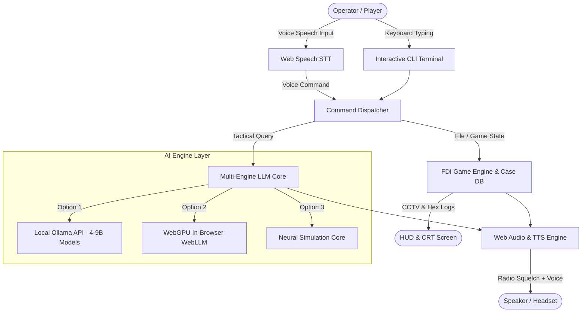

<p align="center">
  
</p>

<h1 align="center">OPERATOR // AI</h1>

<p align="center">
  <strong>A Cyber-Intelligence Terminal Game Powered by Small 4–9B Parameter Models & Local Voice Comms</strong>
  <br>
  <em>Designed for "Programming for AI" University Subject Project</em>
</p>

<p align="center">
  
  
  
  
  
</p>

---

## 📌 1. Project Overview & Inspiration

**OPERATOR // AI** is an interactive, browser-based cyber-investigation game inspired by the indie title [**The Operator**](https://store.steampowered.com/app/1771980/The_Operator/) (by Bureau 81). 

You take on the role of an intelligence console operator at the **Federal Department of Intelligence (FDI)**. Sitting behind your cyber workstation, you receive encrypted radio calls from field agents (e.g. Agent Walker) navigating high-stakes ground operations. By auditing forensic logs, tracing rogue IP addresses, decrypting cipher containers, and querying your **embedded 4–9B parameter LLM co-pilot**, you guide your agent through hostile breaches to catch an elusive cyber syndicate mole.

### 🎯 Key Highlights
- **100% Client-Side on GitHub Pages**: Zero backend required for immediate playability.
- **Small 4–9B LLM Core**: Supports local **Ollama** (`qwen2.5:7b`, `llama3.1:8b`, `gemma2:9b`), in-browser **WebGPU WebLLM**, and a zero-latency local fallback.
- **Local Tactical Voice I/O**: Push-to-Talk (PTT) speech recognition and procedural walkie-talkie radio text-to-speech with bandpass static filter.
- **Authentic Linux-style CLI**: Real command-line engine with command history, auto-completion, mechanical keyboard audio, and retro CRT screen effects.

---

## 🧠 2. "Programming for AI": 4–9B Model Research & Benchmarking

For our *Programming for AI* project, we researched the trade-offs of deploying **small 4–9B parameter models** locally and at the edge versus monolithic cloud models:

| Model | Parameter Size | Primary Strength | Memory (Q4_K_M) | Suited For |
| :--- | :---: | :--- | :---: | :--- |
| **Qwen 2.5 (7B-Instruct)** | **7.6B** | **Top Code & Regex Reasoning** | **~4.7 GB** | **Terminal command generation & log parsing** |
| **Llama 3.1 (8B-Instruct)** | **8.0B** | **128k Context & Roleplay** | **~4.9 GB** | **Tactical agent dialogue & narrative consistency** |
| **Gemma 2 (9B-it)** | **9.2B** | **High Perplexity & Dense Knowledge** | **~5.8 GB** | **Forensic anomaly discovery & intelligence audit** |
| **Phi-3.5 Mini** | **3.8B** | **Ultralight Low Latency** | **~2.4 GB** | **Edge devices, mobile browsers & laptops** |

### Why 4–9B Models for Interactive Terminal Games?
1. **Low VRAM & Consumer Accessibility**: A 7B parameter model quantized to 4-bit runs comfortably on consumer laptops with 6GB–8GB VRAM or unified Apple Silicon memory.
2. **Deterministic Tool & Command Following**: Modern 7B models (especially Qwen 2.5) match or exceed previous generation 70B models on structured task adherence.
3. **Low Latency for Voice Interaction**: Sub-100ms time-to-first-token allows the game's voice engine to deliver real-time walkie-talkie transmissions without immersion-breaking pauses.

---

## 🛠️ 3. Architecture & Data Flow



---

## 🎮 4. Case File #049: Operation Blackout Syndicate

### Story Premise
Generators have failed at the Apex Dynamics Cyber Facility. An unauthorized breach is underway. Tactical field agent **Agent Walker (Badge #8821)** is on-site at the server vaults, but an airlock lockdown has trapped him. You must guide him from the terminal.

### Available Terminal Commands
| Command | Example | Description |
| :--- | :--- | :--- |
| `help` | `help` | Displays tactical instruction manual. |
| `ls` / `dir` | `ls` | Lists case evidence files on the terminal filesystem. |
| `cat <file>` | `cat mission_brief.txt` | Reads contents of logs, dossiers, and network dumps. |
| `decrypt <file> <key>` | `decrypt access_log.enc OMEGA` | Decodes 256-bit encrypted containers with the cipher key. |
| `trace <ip>` | `trace 198.51.100.42` | Performs multi-hop satellite trace of suspect IP address. |
| `cctv [cam_id]` | `cctv CAM-02` | Opens interactive CCTV surveillance matrix with live feeds. |
| `trace <ip>` | `trace 198.51.100.42` | Launches visual satellite tracer map across global nodes. |
| `dossier` | `dossier` | Opens Classified Suspect Pinboard to interrogate or flag suspects. |
| `bypass` | `bypass` | Launches the interactive 6-digit frequency cipher bypass puzzle. |
| `radio <msg>` | `radio 749201` | Transmits verbal orders and passcodes to Agent Walker. |
| `ask <query>` | `ask how to bypass firewall` | Queries your 4–9B parameter LLM co-pilot for forensic guidance. |
| `status` | `status` | Displays active case objectives and AI telemetry. |
| `clear` | `clear` | Clears terminal display buffer. |

---

## 🛰️ 5. Interactive Workstation Views

Beyond the Linux terminal shell, the FDI console features dedicated interactive views:
1. **📹 CCTV Surveillance Matrix:** 4 live simulated feeds (`CAM-01 Lobby`, `CAM-02 Sublevel 2`, `CAM-03 Server B Vault`, `CAM-04 Emergency Exit 4`) with scanlines, live GMT timestamps, CRT noise, and target bounding box scanner.
2. **🌐 Satellite Tracer Radar:** Visual canvas illustrating multi-hop satellite packet propagation from Zurich C2 node to Apex DMZ.
3. **👥 Classified Suspect Pinboard:** Evidence dossier cards for Dr. Vance Alden, Marcus Kane, and Elena Rostova (*SPECTER*) with 1-click AI cross-examination and arrest dispatch.
4. **🔐 Cipher Bypass Minigame:** Interactive 6-dial frequency aligner to breach the Sublevel 2 airlock.
5. **🎧 Atmospheric Bunker Ambience:** Procedurally generated 55Hz sub-bass analog drone and tape-hiss background audio via Web Audio API.

---

## 🚀 6. How to Run & Play

### A. Instant Play in Browser (GitHub Pages)
Navigate to the live URL:
```text
https://hammadshakeelai.github.io/operator-ai/
```
The game starts immediately with the **Neural Simulation Core**.

### B. Connecting a Real Local 4–9B Model (Ollama)
To power the terminal with your local GPU:
1. Install [Ollama](https://ollama.com).
2. Pull your model of choice:
   ```bash
   ollama run qwen2.5:7b
   # or
   ollama run llama3.1:8b
   ```
3. Enable cross-origin requests for browser connections:
   - **Linux / macOS**: `OLLAMA_ORIGINS="*" ollama serve`
   - **Windows**: Set environment variable `OLLAMA_ORIGINS="*"` and restart Ollama.
4. On the game's right panel, switch the model selector to **"Local Ollama: Qwen 2.5 7B"**.

### C. Run Locally with Any HTTP Server
```bash
git clone https://github.com/hammadshakeelai/operator-ai.git
cd operator-ai
python -m http.server 8000
```
Open `http://localhost:8000` in Google Chrome or Microsoft Edge.

---

## 📂 7. Repository File Structure

```text
├── .github/
│   └── workflows/
│       └── deploy.yml        # Auto-deployment to GitHub Pages
├── assets/
│   └── banner.svg            # Cyberpunk SVG banner graphic
├── css/
│   └── terminal.css          # CRT scanlines, HUD styling, multiview tabs & canvases
├── js/
│   ├── audio.js              # Web Audio synth, ambient drone, radio squelch, TTS, and STT
│   ├── llm.js                # Multi-engine 4-9B model adapter with prompt injection defense
│   ├── game.js               # Case file state, objectives, puzzles, CCTV renderer
│   ├── terminal.js           # CLI parser, command history, tab-autocomplete
│   └── views.js              # Interactive CCTV, Satellite Tracer, Pinboard & Bypass game
├── index.html                # Main FDI Operator Workstation UI
├── LICENSE                   # MIT License
└── README.md                 # Project documentation & AI research report
```

---

## 📜 7. License & Credits

- Developed for the **Programming for AI** academic curriculum.
- Inspired by **The Operator** by Bureau 81.
- Released under the [MIT License](LICENSE).
